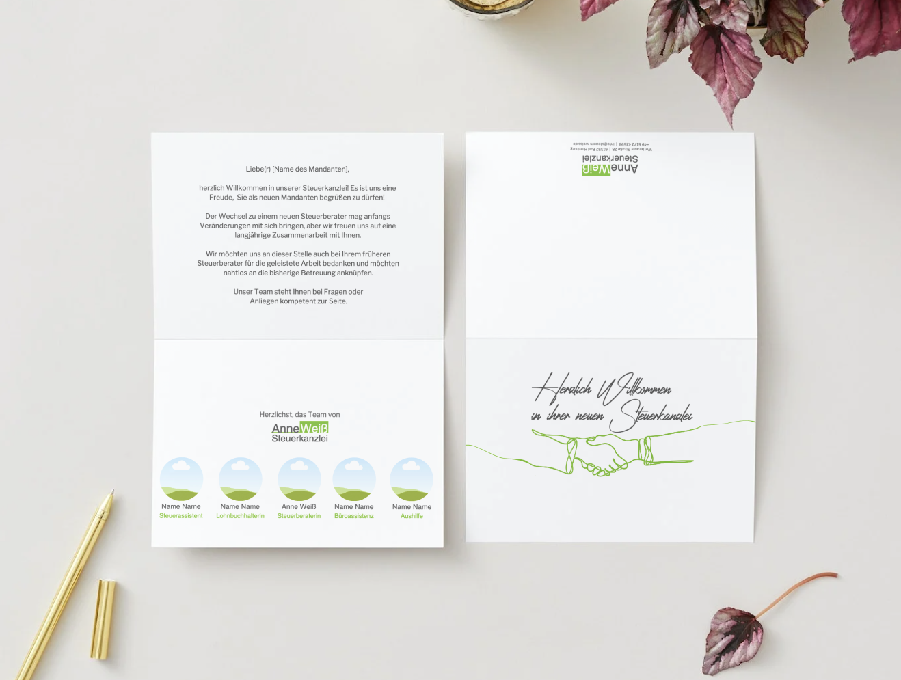
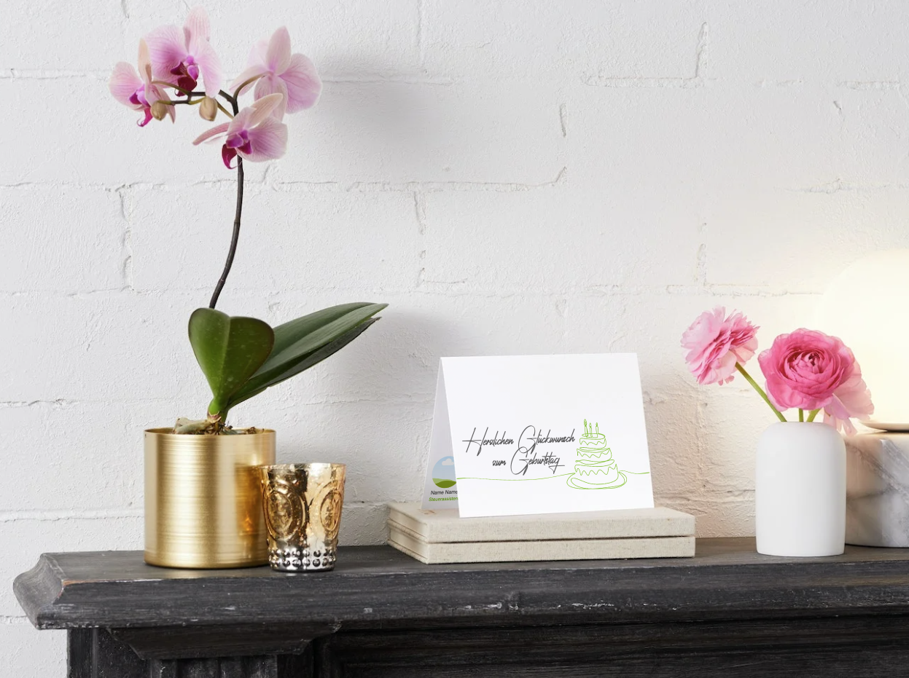
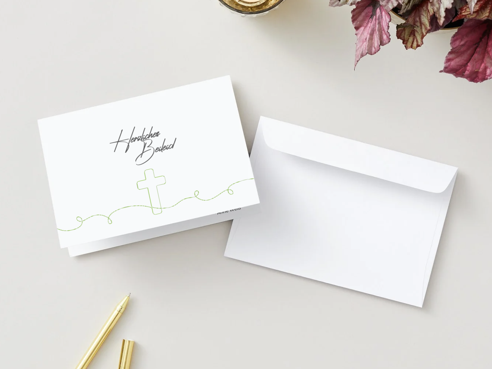
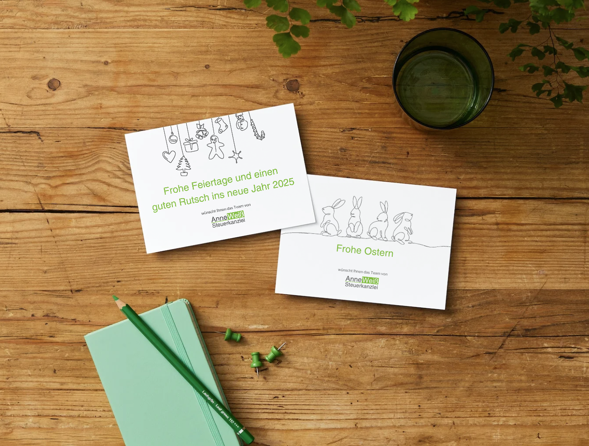
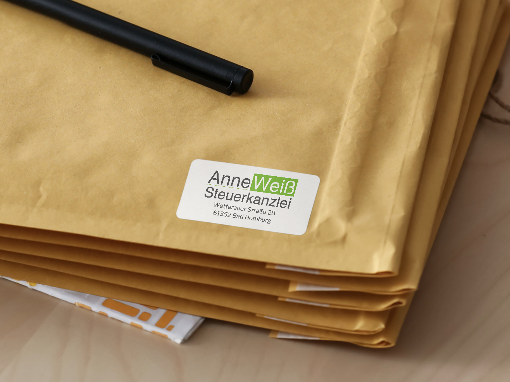
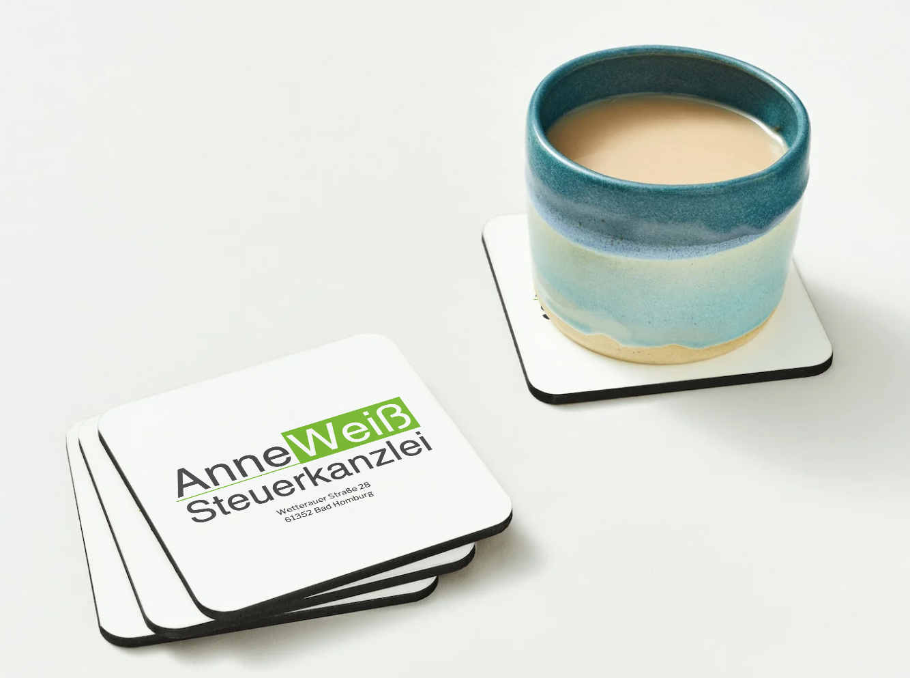
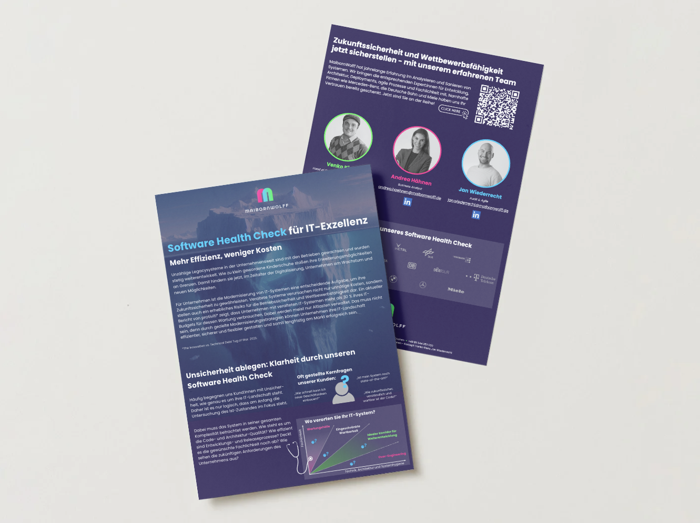
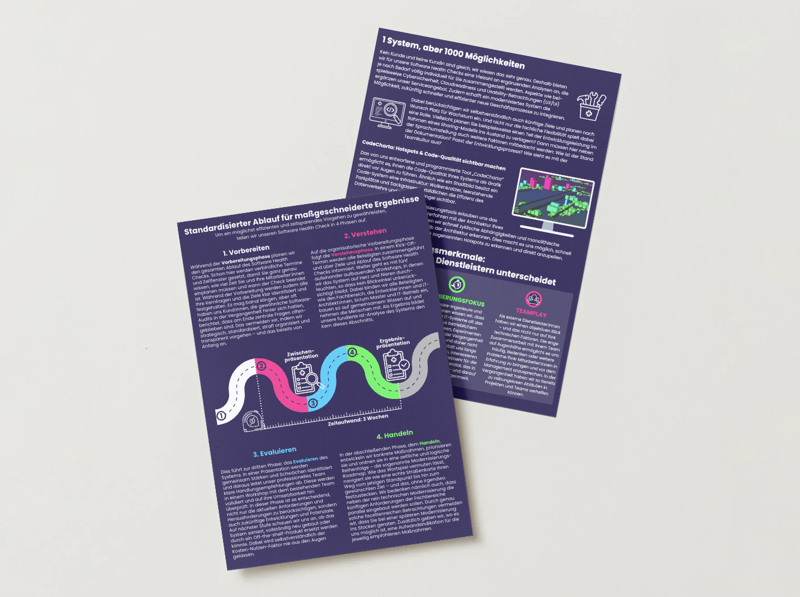
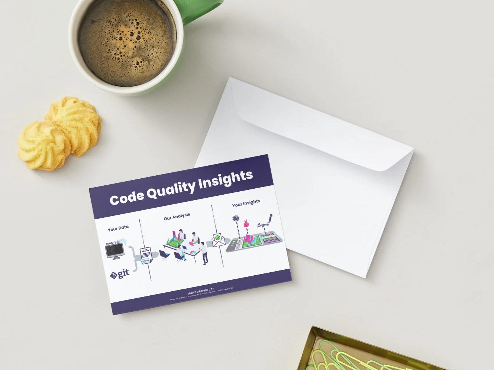

<!-- One -->
<section id="Einleitung Projekte">
    <h4>Erste Einblicke - Meine bisherigen Projekte</h4>
    
Jeder Anfang zählt – und genau hier findest du einen Einblick in meine ersten beruflichen Stationen und Arbeitsproben. Ob kreatives Gestalten im Marketingumfeld oder die Entwicklung individueller Geschäftsausstattungen: In den folgenden Projekten durfte ich wertvolle Erfahrungen sammeln, Verantwortung übernehmen und erste eigene Ideen umsetzen. Diese Seite wächst mit mir – nach und nach kommen weitere Arbeiten hinzu. Vorbeischauen lohnt sich also!

</section>

<!-- Two -->
<section class="bricks">
    <article class="style2">
        
            
        
        
    </article>
    <article class="style5">
        
            
        
        
    </article>
</section>

<!-- Three -->
<section id="Steuerberaterin Anne Weiß">
  <h2>Projekt 1: Steuerberaterin Anne Weiß - Geschäftsausstattung mit Feingefühl</h2>
  
Zwischen Februar und September 2024 war ich als Büroassistenz bei der Steuerberaterin Anne Weiß tätig. In dieser Zeit durfte ich nicht nur im organisatorischen Bereich unterstützen, sondern auch kreativ tätig werden: Ich entwickelte eine maßgeschneiderte Geschäftsausstattung für die Mandantenkommunikation, abgestimmt auf das bestehende Corporate Design der Kanzlei.

  
Entstanden ist eine Serie hochwertiger Faltkarten für verschiedene Anlässe – von der herzlichen Begrüßung neuer Mandant:innen über Glückwünsche zu Jubiläen und Geburtstagen bis hin zu sensibel gestalteten Karten für schwierige Lebensphasen. Ergänzt wurde das Set durch stilvolle Postkarten für festliche Grüße, passende Adressaufkleber und Briefumschläge im einheitlichen Design.

  
So kann die Kanzlei nicht nur professionell, sondern auch persönlich und wertschätzend in Kontakt mit ihren Mandant:innen treten.

      <glider-gallery>
        

            

                <ul class="glide__slides">
                    <li class="glide__slide">
                        
                    </li>
                    <li class="glide__slide">
                        
                    </li>
                    <li class="glide__slide">
                        
                    </li>
                    <li class="glide__slide">
                        
                    </li>
                    <li class="glide__slide">
                        
                    </li>
                    <li class="glide__slide">
                        
                    </li>
                    <li class="glide__slide">
                        
                    </li>
                    <li class="glide__slide">
                        
                    </li>
                </ul>
            

            

                <button class="glide__bullet" data-glide-dir="=0"></button>
                <button class="glide__bullet" data-glide-dir="=1"></button>
                <button class="glide__bullet" data-glide-dir="=2"></button>
            

        

    </glider-gallery>
</section>

<!-- Four -->
<section id="MaibornWolff">
  <h2>Projekt 2: MaibornWolff - Einblicke in IT-Marketing & PreSales</h2>
  
Von Juli bis Dezember 2024 war ich als Trainee Marketing Expert Teil eines Pilotprojekts innerhalb der PreSales Unit des Bereichs ITS bei MaibornWolff. In dieser Zeit konnte ich wertvolle erste Erfahrungen im Bereich Marketing sammeln – sowohl im Austausch mit der internen Marketingabteilung als auch durch die enge Zusammenarbeit mit erfahrenen Kolleg:innen aus dem PreSales-Umfeld. Besonders spannend war für mich die Verbindung aus technischer Expertise und strategischer Kommunikation.

  <h5>Ich durfte aktiv an zwei konkreten Projekten mitwirken:</h5>
  <ul>
        <li>Neugestaltung einer Broschüre für den Software Health Check</li>
        <li>Erstellung einer Info-Grafik für die Kampagne "Code Quality Insights"</li>
    </ul>
    
Mehr über MaibornWolff und die Projekte findest du auf der offiziellen Website: <a href="https://www.maibornwolff.de/">www.maibornwolff.de</a>

    <glider-gallery>
        

          

            <ul class="glide__slides">
              <li class="glide__slide">
                
              </li>
              <li class="glide__slide">
                
              </li>
              <li class="glide__slide">
                
              </li>
            </ul>
          

          

            <button class="glide__bullet" data-glide-dir="=0"></button>
            <button class="glide__bullet" data-glide-dir="=1"></button>
            <button class="glide__bullet" data-glide-dir="=2"></button>
          

        

      </glider-gallery>
</section>
