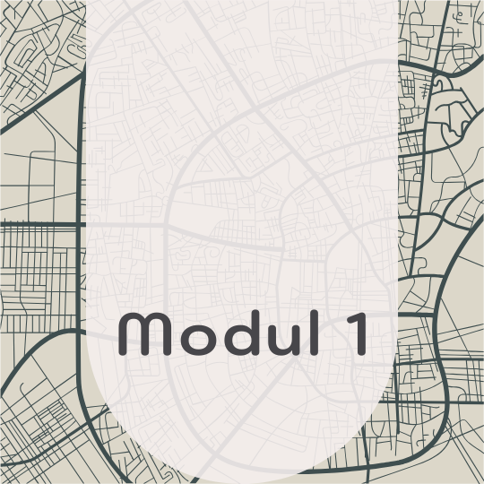
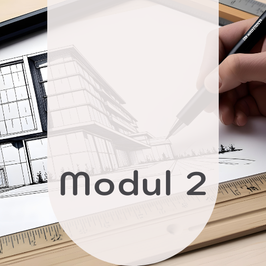
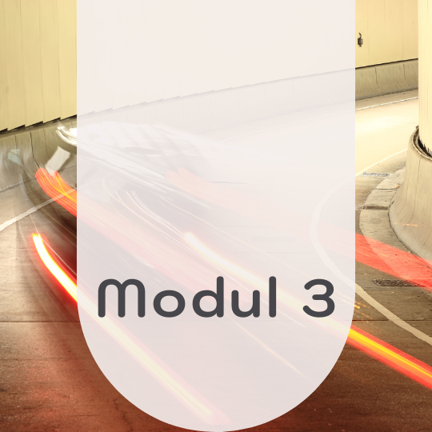

<header class="major">
	<h2>Module</h2>
</header>

<section class="bricks">
	<article class="style1">
		
			
		
		<a href="#modul-1">
			<h2>Stadtplan</h2>
		</a>
	</article>
	<article class="style2">
		
			
		
		<a href="#modul-2">
			<h2>Architektur</h2>
			

				
Modul 2

			

		</a>
	</article>
	<article class="style3">
		
			
		
		<a href="#modul-3">
			<h2>Bewegung</h2>
			

				
Modul 3

			

		</a>
	</article>
</section>

<section id="modul-1">
  <h2>Modul 1: Stadtplan-Design mit System – Illustrator trifft Orientierung</h2>
  

    Im Rahmen der <strong>Adobe Illustrator Masterclass (OfG)</strong> entstand ein digitaler Stadtplanausschnitt, der zeigt, wie kreative Gestaltung und technische Präzision ineinandergreifen.
    Ziel war es, eine flexible Grundgrafik zu entwickeln, die sich durch gezielten Einsatz von Ebenen, Schnittmasken, Farbverläufen und Verzerrungstechniken in verschiedene Stilrichtungen übersetzen lässt.
  

  <h3>Meine Umsetzung:</h3>
  <ul>
    <li><strong>✔ Variante 1 – Street Art Look:</strong> 
      Ein farbenfroher, dynamischer Stadtplan mit lebendigen Strukturen. Durch den Einsatz von Verzerrungswerkzeugen, individuellen Pfadbearbeitungen und Farbverläufen entsteht ein moderner, urbaner Look, inspiriert vom Street Art-Stil.
    </li>
    <li><strong>✔ Variante 2 – Klar & Informativ:</strong> 
      Minimalistisch, strukturiert, funktional. Die Karte fokussiert auf eine saubere Darstellung mit Icons, Legende und gezielten Hervorhebungen durch dezente Flächen und Linienmuster – für maximale Übersichtlichkeit.
    </li>
  </ul>
  <h4>Technischer Fokus:</h4>
  

    Die Gestaltung basiert auf einer einzigen, präzise aufgebauten Illustrator-Datei mit klar getrennten Ebenen. So lassen sich unterschiedliche Varianten schnell und effizient visualisieren.
  

  
<em>Gestaltung, die Orientierung schafft – vielseitig, technisch sauber und mit Blick fürs Detail.</em>

</section>

<section id="modul-2">
  <h2>Modul 2: Perspektive trifft Pixel – Architektur im digitalen Raum</h2>
  

    Für das zweite Modul der <strong>Adobe Illustrator Masterclass</strong> lautete die Aufgabe: Gestalte eine farbige, ganzseitige Illustration zum Thema „Science Fiction“ oder „Architektur“ – und zwar unter Einsatz neu erlernter Techniken wie Symbolen, Mustern, 3D-Objekten und perspektivischem Arbeiten.
  

  

    Meine Wahl fiel auf das Thema „Architektur“ – ein Feld, das mich sowohl technisch als auch emotional begeistert.
  

  

    Doch nicht alles verlief geradlinig: Der Umgang mit dem Perspektive-Werkzeug war zu Beginn mehr Zickzack als Zen, doch genau darin lag der kreative Reiz. Um die Technik zu meistern, habe ich zunächst eine bestehende Grafik rekonstruiert – ein lehrreicher Zwischenschritt mit nachhaltigem Effekt.
  

  <h3>Zwei visuelle Konzepte:</h3>
  <ul>
    <li><strong>🔹 Variante 1: Architektur Ausstellung:</strong> 
      Ein stilisiertes Hochhaus, gebaut aus perspektivisch eingesetzten Symbolen und mit Tiefe durch gezielte Schattensetzung. Rahmen und Text wurden technisch sauber ins perspektivische Raster integriert – akzentuiert durch das Symbol-Aufsprühen-Werkzeug und die Aussehen-Palette.
    </li>
    <li><strong>🔹 Variante 2: Space Exhibition:</strong> 
      Hier trifft Architektur auf Kosmos: Mit einer eigens erstellten Musterbordüre aus Halb- und Vollmonden sowie zwei 3D-Objekten (Saturn & Halbmond) wurde das Ganze visuell ins Weltall katapultiert. Die Typografie folgt der Raumtiefe – um die Ecke gedacht, im wahrsten Sinne.
    </li>
  </ul>
  <h4>Technisch zum Einsatz kamen:</h4>
  <ul>
    <li>Perspektive-Werkzeug</li>
    <li>Symboltechnik</li>
    <li>Muster-Erstellung</li>
    <li>3D-Formen</li>
    <li>Aussehen-Palette</li>
  </ul>
</section>

<section id="modul-3">
  <h2>Modul 3: Bewegung trifft Blaupause – technisches Zeichnen mit Vektor-Drive</h2>
  

    In der dritten Aufgabe der Illustrator Masterclass drehte sich alles um die Themen „Bewegung“ und „Dynamik“ – interpretiert durch digitale Illustration, kreative Verzerrung und den geschickten Einsatz von Masken, Pinseln und Effekten.
  

  

    Meine Idee: technische Zeichnungen im Stil von Blaupausen – wo Bewegung durch Präzision, Linienführung und Komposition spürbar wird.
  

  <h3>🔧 Variante 1: Blaupause mit Charakter</h3>
  

    Ein Oldtimer – frontal und seitlich – wird zum Träger der Bewegung. Die Formsprache lebt von einem selbst konstruierten Gittermuster, vektorisierten Reifenspuren und illustrativen Schraffuren mit Kohlepinsel. 
    Typografie und Effekte? Eine Mischung aus „Scribble“, Verzerrungsfilter und einem selbst gestalteten Buchstaben-Pinsel verleihen dem Schriftzug skizzenhaften Charme. Die Zielflagge? Natürlich in 3D gedreht und „geflaggt“. Als zusätzliches Detail wurde ein fotografiertes Modellauto mit Pfaden vektorisiert und per Deckkraftmaske ins Bild integriert.
  

  <h3>📏 Variante 2: Millimeterpapier mit Kaffeefleck</h3>
  

    Die zweite Illustration ist eine Hommage an analoge Skizzenarbeit:
    Ein digitales Millimeterpapier mit selbst gemaltem Gitter, umrahmt von Bleistift- und Fineliner-Optik. Oben auf dem Zeichenblatt liegen illustrative Bilder echter Stifte, ergänzt durch symbolische Kaffeeflecken – für ein Augenzwinkern inmitten technischer Genauigkeit. Die Typografie erinnert an verschmierte Graphit-Schraffuren, ergänzt mit roten Markierungen à la Fine-Liner.
  

  <h4>🛠️ Eingesetzte Techniken:</h4>
  <ul>
    <li>Grafikstile</li>
    <li>Verzerrungs- & Transformationsfilter</li>
    <li>Formgitter & Verkrümmung</li>
    <li>Interaktiv-Malen</li>
    <li>Bildnachzeichner & Deckkraftmasken</li>
    <li>Eigene Pinsel & Symbole</li>
  </ul>
</section>
