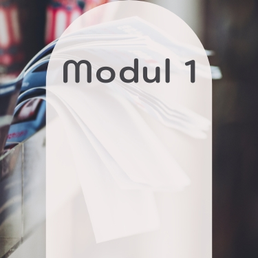
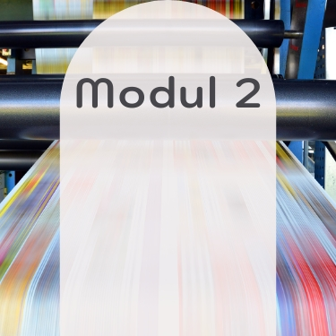

    

  <!-- One -->
  <section id="Einleitung Id-Masterclass">
    
Weiter geht es mit der letzten der drei Masterclasses bei der OfG - Adobe InDesign. Auf die habe ich mich richtig gefreut, eventuell da InDesign mir bisher immer am meisten Spaß gemacht hat.

  </section>

  <!-- Two -->
  <section class="bricks">
    <article class="style1">
      
        
      
      <a href="#modul-1">
        <h2>Print</h2>
      </a>
    </article>
    <article class="style2">
      
        
      
      <a href="#modul-2">
        <h2>Automatisierung</h2>
      </a>
    </article>
    <article class="style3">
      
        
      
      <a href="#modul-3">
        <h2>Interaktivität</h2>
      </a>
    </article>
  </section>
  

<!-- Six -->
  

    <a class="button previous" href="">
      Vorheriger Kurs
    </a>
    <a class="button" href="">
      Projekte
    </a>
  

