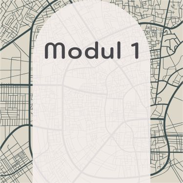

    

  <!-- One -->
  <section id="Einleitung Ai-Masterclass">
    
Dieser Abschnitt dokumentiert meinen Lernprozess im Rahmen der Adobe Illustrator Masterclass. In drei Modulen habe ich mich intensiv mit verschiedenen Aspekten zum Thema Vektorgrafiken beschäftigt – von urbanen Karten über architektonische Illustrationen bis hin zu dynamischen Gestaltungstechniken. Jeder Abschnitt dieser Seite zeigt, was ich in den jeweiligen Modulen gelernt, ausprobiert und entwickelt habe. Dabei standen nicht nur technische Fähigkeiten im Vordergrund, sondern auch mein persönlicher Zugang zu Form, Farbe und Raum.

    
Die Masterclass war für mich ein wichtiger Schritt, um Illustrator nicht nur als Werkzeug, sondern als kreatives Ausdrucksmittel zu begreifen – strukturiert, herausfordernd und überraschend vielseitig.

  </section>

  <!-- Two -->
  <section class="bricks">
    <article class="style1">
      
        
      
      <a href="#modul-1">
        <h2>Stadtplan</h2>
      </a>
    </article>
    <article class="style2">
      
        
      
      <a href="#modul-2">
        <h2>Architektur</h2>
      </a>
    </article>
    <article class="style3">
      
        
      
      <a href="#modul-3">
        <h2>Bewegung</h2>
      </a>
    </article>
  </section>
  

  <!-- Three -->
  <section id="modul-1" class="anchor">
    <h2>Modul 1: Stadtplan – Illustrator trifft Orientierung</h2>
    
Im Rahmen der ersten Monatsaufgabe entstand ein digitaler Stadtplanausschnitt, der zeigt, wie kreative Gestaltung und technische Präzision ineinandergreifen. Ziel war es, eine flexible Grundgrafik zu entwickeln, die sich durch gezielten Einsatz von Ebenen in die zwei verschiedenen Stilrichtungen übersetzen lässt. Die Gestaltung basiert also auf einer einzigen, präzise aufgebauten Illustrator-Datei mit klar getrennten Ebenen. So lassen sich unterschiedliche Varianten schnell und effizient durch das ein- bzw. ausblenden von Ebenen visualieren. Zum Einsatz kamen hier Tools wie der Pathfinder und andere Formerstellungsmethoden, das Arbeiten mit Ebenen und Schnittmasken, die Verwendung von Farbverläufen und Texteffekten, sowie Verzerrungs-Werkzeuge. Gestaltung die Orientierung schafft - vielseitig, technisch gut umsetzbar und mit Blick fürs Detail.

    <h3 style="text-align: left;">Meine zwei Umsetzungen:</h3>
    <image-compare class="image image__center" data-position="center center">
        
        
    </image-compare>
    

      

        <h4>Variante 1 – Street Art Look:</h4>
        
Ein farbenfroher, dynamischer Stadtplan mit lebendigen Strukturen. Durch den Einsatz von Verzerrungswerkzeugen, individuellen Pfadbearbeitungen und Farbverläufen entsteht ein moderner, urbaner Look, inspiriert vom Street Art-Stil.

      

      

        <h4>Variante 2 – Klar & Informativ:</h4>
        
Minimalistisch, strukturiert, funktional. Die Karte fokussiert auf eine saubere Darstellung mit Icons, Legende und gezielten Hervorhebungen durch dezente Flächen und Linienmuster – für maximale Übersichtlichkeit.

      

    

  </section>

  

  <!-- Four -->
  <section id="modul-2" class="anchor">
    <h2>Modul 2: Architektur - Perspektive im digitalen Raum</h2>
    
In der zweiten Monatsaufgabe war eine ganzseitige Illustration zum Thema "Architektur" oder Science Fiction" gewünscht. Meine Wahl fiel auf das Thema Architektur: ein Feld, das mich sowohl technisch als auch emotional begeistert. Der Umgang mit dem Perspektive-Werkzeug fiel mir anfangs sehr schwer. Um die Technik zu meistern, habe ich zunächst eine bestehende Grafik rekonstruiert – ein lehrreicher Zwischenschritt mit nachhaltigem Effekt. Weitere technische Tools wie die Erstellung von Symbolen und Mustern, die Verwendung von Pinsel/Tropfenpinseln und Rahmenformen, sowie 3D-Formen gehörten ebenfalls zu dieser Aufgabe.

    <h3 style="text-align: left;">Meine zwei Konzepte:</h3>
    <image-compare class="image image__center" data-position="center center">
        
        
    </image-compare>
    

      

        <h4>Variante 1 – Architektur Ausstellung:</h4>
        
Ein stilisiertes Hochhaus, gebaut aus perspektivisch eingesetzten Symbolen und mit Tiefe durch gezielte Schattensetzung. Der Text wurde technisch sauber ins perspektivische Raster integriert. Das gesamte Bild wurde durch einen Rahmen akzentuiert, welcher durch das Symbol-Aufsprühen-Werkzeug nochmal Struktur bekam.

      

      

        <h4>Variante 2 – Space Exhibition:</h4>
        
Hier trifft Architektur auf Kosmos. Ankerpunkt blieb das stiliserte Hochhaus im Zentrum des Bildes. Mit einer eigens erstellten Musterbordüre aus Halb- und Vollmonden sowie zwei 3D-Objekten (Saturn & Halbmond) wurde das Ganze visuell ins Weltall katapultiert. Die Typografie folgt der Raumtiefe – um die Ecke gedacht, im wahrsten Sinne.

      

    

    <glider-gallery lightbox-id="Modul 2 Thema Architektur - Science Fiction" per-view-max="3">
            
                
      
    </glider-gallery>
  </section>

  

  <!-- Five -->
  <section id="modul-3" class="anchor">
    <h2>Modul 3: Bewegung – technisches Zeichnen mit Vektor-Drive</h2>
    
In der dritten und letzten Monatsaufgabe drehte sich alles um die Themen „Bewegung“ oder „Dynamik“ – interpretiert durch digitale Illustration, kreative Verzerrung und den geschickten Einsatz von Masken, Pinseln und Effekten. Meine Idee zur Umsetzung waren technische Zeichnungen im Stil von Blaupausen bzw. auf Millimeterpapier – wo Bewegung durch Präzision, Linienführung und Komposition spürbar wird. Weitere verwendete Werkzeuge waren hier u.a. Grafikstile, Verzerrungs- & Transformationsfilter, Formgitter & Verkrümmungen, der Bildnachzeichner und Deckkraftmasken.

    <h3 style="text-align: left;">Meine zwei Realisierungen:</h3>
    <image-compare class="image" data-position="center center">
        
        
    </image-compare>
    

      

        <h4>Variante 1 – Blaupause mit Charakter:</h4>
        
Eine Oldtimer-Zeichnung – frontal und seitlich – wird zum Träger der Bewegung. Die Formsprache lebt von einem selbst konstruierten Gittermuster, vektorisierten Reifenspuren und illustrativen Schraffuren mit Kohlepinsel. Typografie und Effekte sind eine Mischung aus „Scribble“, Verzerrungsfilter und einem selbst gestalteten Buchstaben-Pinsel, welche dem Schriftzug einen skizzenhaften Charme verleihen. Als zusätzliches Detail wurde ein fotografiertes Modellauto mit Pfaden vektorisiert und per Deckkraftmaske ins Bild integriert.

      

      

        <h4>Variante 2 – Millimeterpapier mit Kaffeeflecken:</h4>
        
Die zweite Illustration ist eine Hommage an analoge Skizzenarbeit. Ein Millimeterpapier mit selbst gemaltem digitalem Gitter, umrahmt von Bleistift- und Fineliner-Optik, welche den Reiz eines solch ehrwürdigen Rohentwurfs verdeutlichen sollen. Die Typografie erinnert an verschmierte Graphit-Schraffuren, ergänzt mit roten Markierungen à la Fine-Liner. Über dem Zeichenblatt liegen illustrative Bilder echter Stifte, ergänzt durch symbolische Kaffeeflecken und der obligatorischen Kaffeetasse – für ein Augenzwinkern inmitten technischer Genauigkeit. 

      

    

  </section>

<!-- Six -->
  

    <a class="button previous" href="">
      Vorheriger Kurs
    </a>
    <a class="button" href="">
      Projekte
    </a>
    <a class="button next" href="">
      Nächster Kurs 
    </a>
  

