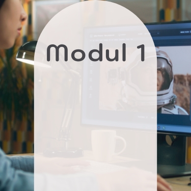
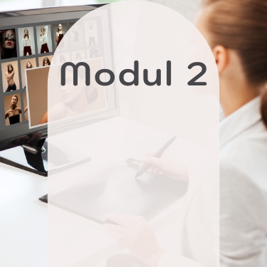
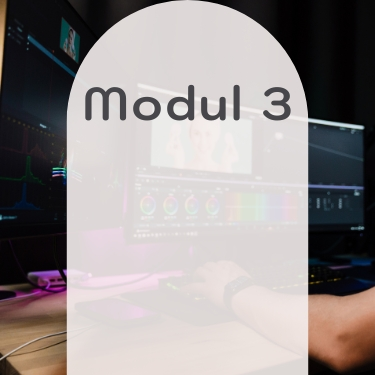

    

  <!-- One -->
  <section id="Einleitung Ps-Masterclass">
    
Nun bin ich bereits in meinem dritten OfG-Kurs, der Adobe Photoshop Masterclass, angekommen. Und diesmal ging es frei nach dem Motto: Bilden, bearbeiten, begeistern - mein Weg zur Bildbearbeitung. Die drei Module waren erneut intensiv und vielseitig: von den Grundlagen der Bildebarbeitung mit Tonwertkorrekturen, Gradationskurven und Selektiver Farbauswahl, über Maskieren und Ebenenstile, bis hin zur Retusche, Freistellen und finalen Composing. Die Techniken wurden anhand vieler anschaulicher Beispielbilder erklärt, sodass man wie gewohnt alles direkt am eigenen Bildschirm nachvollziehen und üben konnte. Besonders die Modulaufgaben waren eine wertvolle Gelegenheit, das frisch erlernte Wissen praktisch umzusetzen und zu vertiefen. 

    
Auch wenn Photoshop wohl nie zu meinem Lieblingsprogramm innerhalb der Adobe-Welt wird, fasziniert mich immer wieder aufs Neue, welche kreativen Möglichkeiten die Bildbearbeitung eröffnet. Die Masterclass war für mich wieder ein weiterer wichtiger Meilenstein auf meinem Weg zum Crossmedia-Designer!

  </section>

<!-- Two -->
  <section class="bricks">
    <article class="style1">
      
        
      
      <a href="#modul-1">
        <h2>Bildmotiv & Bildmontage</h2>
      </a>
    </article>
    <article class="style2">
      
        
      
      <a href="#modul-2">
        <h2>Retusche & Look</h2>
      </a>
    </article>
    <article class="style3">
      
        
      
      <a href="#modul-3">
        <h2>Composing</h2>
      </a>
    </article>
  </section>
  

<!-- Three -->
  <section id="modul-1" class="anchor">
    <h2>Modul 1: Bildmotiv und Bildmontage</h2>
    
Für das erste Modul wurden zwei Teilaufgaben gefordert: zum einen musste eine Bildoptimierung eines selbst fotografierten Motivs durchgeführt werden. Dazu gehörten z.B. eine Farbkorrektur, Kontrast- und Belichtungs-Optimierungen und mindestens eine Korrektur mit Hilfe einer Bereichs-Maske. Außerdem musste eine einfache Bildmontage angefertigt werden. Dazu musste ein Objekt sauber freigestellt und mit passendem Größen- und Lichtverhältnissen in ein zweites Foto montiert werden.

    <h3 style="text-align: left;">Mein Bildmotiv: Die Burg von Buda</h3>
    
In der ersten Aufgabe stand die Optimierung eines selbst fotografierten Motivs im Mittelpunkt. Ziel war es, das Bild durch gezielte Anpassungen in Farbe, Kontrast und Belichtung zu verbessern und mithilfe einer Bereichsmaske präzise Korrekturen vorzunehmen. Mein gewähltes Motiv zeigt die Burg von Buda in Budapest. Ausgehend von meinem Ausgangsfoto habe ich zunächst die Grundwerte angepasst, um mehr Tiefe und Dynamik zu erzeugen. Anschließend habe ich mit einer Maske den Himmel gezielt mit etwas mehr Kontrast versehen. Das Ergebnis wirkt nun ausgewogener in der Belichtung und hat eine deutlich lebendigere Bildwirkung, was vor allem in dem satteren Grün der Bäume herauskommt. Auf den ersten Blick sieht man den Unterschied hier nicht sofort, verwende den Schieberegler um beide Bilder im direkten Vergleich zu sehen. Links befindet sich die Original-Aufnahme und rechts das überarbeitete Bildmotiv.

    <image-compare class="image image__center" data-position="center center">
        
        
    </image-compare>
    <h3 style="text-align: left;">Meine Bildmontage: Birthday Girl</h3>
    
Für meine Bildmontage habe ich ein Foto meiner Tochter verwendet und sie in ein Freepik-Motiv von Alena Zamotaeva eingepasst. Das fertige Bild sieht nun so aus, als hätte sie wirklich vor dieser Wand gesessen und wäre dort fotografiert worden. Damit die Montage realistisch wirkt, habe ich besonders auf die Lichtverhältnisse geachtet und selbst passende Schatten ergänzt.

    <glider-gallery lightbox-id="Grundlagen Photoshop">
          
          
          
      </glider-gallery>
  </section>

  

  <!-- Four -->
  <section id="modul-2" class="anchor">
    <h2>Modul 2: Retusche, Optimierung und Look</h2>
    
Im zweiten Modul waren ebenfalls zwei Teilaufgaben gefragt. Es war eine Bearbeitung und Retusche eines Portraitfotos gefordert. Dazu zählten u.a. die Entfernen störender Bildbereiche und die Retusche des Bildes mit deutlichen Verbesserungen. Als zweite Aufgabe fiel meine Wahl auf die konzeptionelle Umsetzung. Schon während des Durcharbeiten der Theorie fand ich die Erstellung eines alten Polaroid-Bildes sehr spannend.

    <h3 style="text-align: left;">Meine Retusche: Ein Portraitbild von mir</h3>
    
Bei meiner ersten Retusche wollte ich mich behutsam an das Thema herantasten und bewusst einen natürlichen Look beibehalten. Das verwendete Foto stammt von einem Vorher-Bild, das meine Kosmetikerin für ein Babybauch-Shooting aufgenommen hatte. Durch den angepassten Weißabgleich und gezielte selektive Farbkorrekturen konnte ich den leichten Gelbstich neutralisieren. Zudem wurden kleine Fusseln auf dem schwarzen T-Shirt entfernt und mithilfe verschiedener Filter Haut und Gesichtspartien dezent optimiert. Besonders gelungen finde ich den natürlichen, harmonischen Farbton der Lippen. Hier könnt ihr wieder den Schieberegler verwenden um den direkten Vergleich zu haben: links die Original-Aufnahme und rechts das retuschierte Bild.

    <image-compare class="image image__center" data-position="center center">
        
        
    </image-compare>
    <h3 style="text-align: left;">Meine konzeptionelle Umsetzung: Polaroid-Look der Dohány utcai Zsinagóga</h3>
    
Bei unserem Budapest-Urlaub habe ich ein Foto der Dohány-Synagoge gemacht. Die Architektur fand ich unglaublich spannend und der Bildausschnitt hat sich perfekt für eine konzeptionelle Umsetzung angeboten. Schritt für Schritt habe ich daraus einen alten, leicht ausgeblichenen Polaroid-Look entwickelt. Besonders zusammen mit dem Mockup wirkt das Polaroid auf dem Fotoalbum richtig stimmig und kommt super zur Geltung.

    <image-lightbox>
      
      </image-lightbox>
  </section>

  

  <!-- Five -->
  <section id="modul-3" class="anchor">
    <h2>Modul 3: Composing</h2>
    
In der dritten und letzten Monatsaufgabe drehte sich alles um die Themen „Bewegung“ oder „Dynamik“ – interpretiert durch digitale Illustration, kreative Verzerrung und den geschickten Einsatz von Masken, Pinseln und Effekten. Meine Idee zur Umsetzung waren technische Zeichnungen im Stil von Blaupausen bzw. auf Millimeterpapier – wo Bewegung durch Präzision, Linienführung und Komposition spürbar wird. Weitere verwendete Werkzeuge waren hier u.a. Grafikstile, Verzerrungs- & Transformationsfilter, Formgitter & Verkrümmungen, der Bildnachzeichner und Deckkraftmasken.

    <h3 style="text-align: left;">Aus zwei Bildern wird eins:</h3>
    
Text zur Bildbearbeitung

    <glider-gallery lightbox-id="Grundlagen Photoshop">
          
          
          
      </glider-gallery>
  </section>

<!-- Six -->
  

    <a class="button previous" href="">
      Vorheriger Kurs
    </a>
    <a class="button" href="">
      Projekte
    </a>
    <a class="button next" href="">
      Nächster Kurs 
    </a>
  

