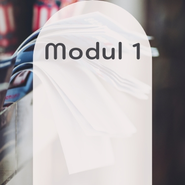
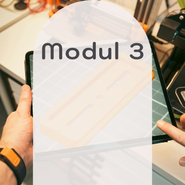

    

  <!-- One -->
  <section id="Einleitung Id-Masterclass">
    
Nach meinen intensiven Kursen durch die Grundlagen der Grafiksoftware und die beiden Masterclasses in Adobe Illustrator und Photoshop, führte mich dieser Kurs in die Welt des professionellen Layouts und der Buch-, Magazin- und Publikationsgestaltung. In der Adobe InDesign Masterclass stand nicht nur das Entwickeln klarer, funktionaler Layouts im Fokus, sondern auch der souveräne Umgang mit Struktur, Typografie und interaktiven Elementen – vom klassischen Printprodukt bis zur digitalen Publikation.

    
Jedes Modul bot neue Herausforderungen: Layout-Strategien, Automatisierungs-Workflows, typografische Entscheidung und Interaktionstechniken, die InDesign als zentrales Werkzeug im Crossmedia-Design zeigen. Auf dieser Seite dokumentiere ich die Ergebnisse zu den jeweiligen Aufgaben – strukturiert, praxisnah und mit Blick auf professionelles Design.

  </section>

  <!-- Two -->
  <section class="bricks">
    <article class="style1">
      
        
      
      <a href="#modul-1">
        <h2>Print</h2>
      </a>
    </article>
    <article class="style2">
      
        
      
      <a href="#modul-2">
        <h2>Automatisierung</h2>
      </a>
    </article>
    <article class="style3">
      
        
      
      <a href="#modul-3">
        <h2>Interaktivität</h2>
      </a>
    </article>
  </section>
  

<!-- Three -->
  <section id="modul-1" class="anchor">
    <h2>Modul 1: Print – InDesign wird greifbar</h2>
    
In dieser Aufgabe wurde ein 6-seitiger DIN-lang-Flyer im Wickelfalz für einen fiktiven Hörgeräte-Akustiker mit Namen "KlangHafen Akustik" gestaltet. Der Fokus lag auf der professionellen Printvorbereitung in Adobe InDesign: von der korrekten Druckbogenanordnung mit verkürzten Seiten über Textverkettungen bis hin zur strukturierten typografischen Gestaltung. Das Layout wurde übersichtlich aufgebaut, mit klaren Absatzformaten, Infoboxen und Ebenenstruktur. Zusätzlich wurde auf drucktechnische Anforderungen wie Farbprofil, Anschnitt, PDF-Exportstandards sowie einen partiellen UV-Lack auf der Titelseite geachtet. Ein besonderer Moment war für mich, den fertigen Flyer anschließend aus meinem Heimdrucker gedruckt in den Händen zu halten – dadurch wurde der gesamte Gestaltungs- und Produktionsprozess unmittelbar greifbar.

    <h3 style="text-align: left;">Mein Flyer der Firma "KlangHafen Akustik":</h3>
    <glider-gallery lightbox-id="Modul 1 Thema Print - Flyer" per-view-max="4">
      
      
      
      
      
    </glider-gallery>
  </section>

  

<!-- Four -->
  <section id="modul-2" class="anchor">
    <h2>Modul 2: Automatisierung - Individuelle Einladungskarten mit Variablen</h2>
    
In dieser Modulaufgabe wurde eine vierseitige DIN-A5-Einladung für einen jährlich wiederkehrenden Event gestaltet, mit dem Schwerpunkt auf Automatisierung und Personalisierung. Mithilfe von Musterseiten, Absatz-, Zeichen- und Objektformaten sowie Textvariablen wurde ein konsistentes Layout aufgebaut. Die rechte Innenseite als auch schon die Titelseite der Einladung wurde automatisiert personalisiert: je nach Rang in der Gesellschaft wechselt die Einladungskarte das Farbkonzept, die Ansprache, die Namen und weitere Inhalte, welche über eine Datenzusammenführung mit einer CSV-Datei eingefügt wurden. Ziel war es, einen effizient reproduzierbaren Gestaltungsprozess zu entwickeln, der sowohl gestalterisch als auch technisch den Anforderungen der professionellen Printproduktion entspricht.

    <h3 style="text-align: left;">Meine Einladung zur Jahresversammlung der "Aurora Society":</h3>
    <glider-gallery lightbox-id="Modul 2 Thema Automatisierung - Einladungskarten" per-view-max="4">
      
      
      
      
      
      
    </glider-gallery>
  </section>

  

<!-- Five -->
  <section id="modul-3" class="anchor">
    <h2>Modul 3: Interaktivität – ein interaktives EPUB-Magazin</h2>
    
In dieser Modulaufgabe wurde ein interaktives Magazin im DIN-A4-Format gestaltet, das sowohl als EPUB mit festem Layout als auch über Publish Online veröffentlicht wurde. Der Schwerpunkt lag auf der Verknüpfung von Editorial Design und Interaktivität. Das Magazin wurde strukturiert mit Ebenen, Musterseiten, Absatz- und Zeichenformaten aufgebaut und um interaktive Elemente wie Animationen, Schaltflächen, Hyperlinks und ein Video ergänzt. Ziel war es, ein visuell ansprechendes Magazin zu entwickeln, bei dem Animationen und Interaktionen einen echten Mehrwert bieten und die Inhalte lebendig erlebbar machen. Die Titelseite wurde dabei bewusst so gestaltet, dass sie zugleich als aussagekräftiges Thumbnail funktioniert.
    Hier kann sich das interaktive Magazin als Publish Online Dokument angeschaut werden: <a href="{{ 'assets/images/4-OfG-Kurse/4_Id-Masterclass/Publish-Online-Magazin.rtf' | relative_url }}" target="_blank" title="Publish-Online-Magazin" style="outline: medium none">Publish-Online-Magazin</a> (Achtung: es öffnet sich zuerst ein Text-Dokument mit benötigten Informationen)

    <h3 style="text-align: left;">Mein Jahresabschluss-Magazin "Lesenswert - ihr Leseraum Magazin":</h3>
<glider-gallery lightbox-id="Modul 3 Thema Interaktivität - Magazin" per-view-max="4">
      
      
      
      
      
      
    </glider-gallery>
  </section>

<!-- Six -->
  

    <a class="button previous" href="">
      Vorheriger Kurs
    </a>
    <a class="button" href="">
      Projekte
    </a>
    <a class="button" href="">
      Seeds Ausbildung
    </a>
  

